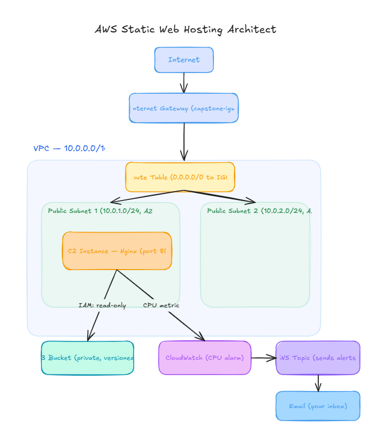

# AWS Static Web Application Hosting

## Project Overview

This project demonstrates how to host a static web application on an
Amazon EC2 instance using a custom Amazon VPC.

The project also uses Amazon S3 for backup storage, IAM for secure
access, and Amazon CloudWatch with Amazon SNS for monitoring and
CPU utilization alerts.

## AWS Services Used

- Amazon VPC
- Amazon EC2
- Amazon S3
- AWS IAM
- Amazon CloudWatch
- Amazon SNS
- Internet Gateway
- Security Groups

## Architecture

## Network Configuration

VPC CIDR:

10.0.0.0/16

Public Subnets:

- public-subnet-1: 10.0.1.0/24
- public-subnet-2: 10.0.2.0/24

Internet Gateway provides internet access to the public subnets.

## EC2 Configuration

The web server runs on an EC2 instance inside public-subnet-1.

Nginx is used as the web server.

The website is accessible through:

http://EC2-PUBLIC-IP

## Security

The Security Group allows:

- SSH (22) – My IP only
- HTTP (80) – 0.0.0.0/0

## S3

The website source files are stored in an S3 bucket as a backup.

The EC2 instance uses an IAM role with read-only access to the
specific S3 bucket.

## Monitoring

Amazon CloudWatch monitors EC2 CPU utilization.

An alarm is configured when CPU utilization exceeds 70%.

CloudWatch sends the alarm notification to an Amazon SNS topic.

SNS then sends an email notification.

## Project Structure

aws-static-web-capstone/

├── README.md
├── website/
│   └── index.html
├── scripts/
│   └── deploy.sh
├── iam/
│   └── s3-readonly-policy.json
├── screenshots/
└── architecture-diagram.png

## Screenshots

### VPC Resource Map

### IAM Role

### Running Website

### SNS Subscription

### CloudWatch Alarm

### Alarm Email

## Conclusion

This project demonstrates the deployment of a static web application
using Amazon EC2 inside a custom VPC, with IAM-based access to S3 and
CloudWatch/SNS-based monitoring and alerting.